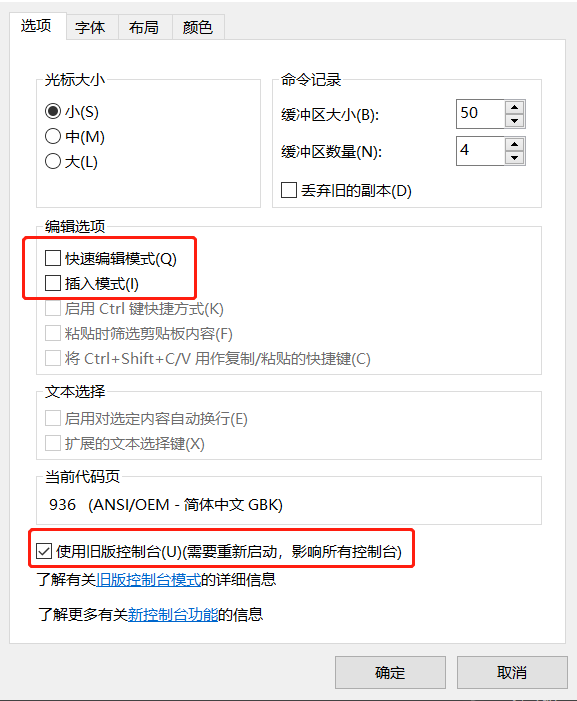
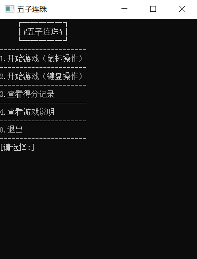
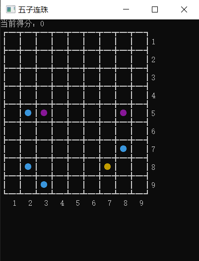
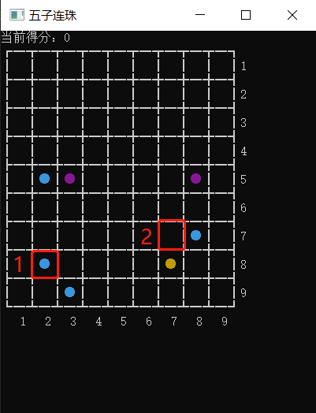
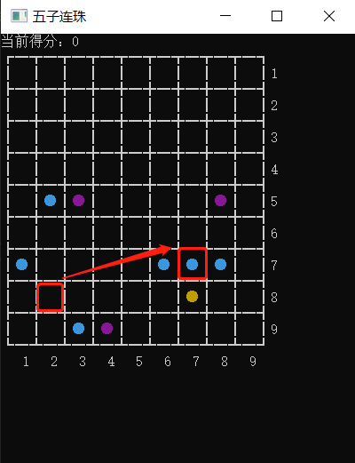

# ColorBall

## 项目简介

用C++编写控制台程序，模拟完成一个单人益智小游戏“五子连珠”。

棋盘大小是9X9，一共会出现6种颜色的珠子。初始状态棋盘上7个随机位置分布着7个随机颜色的珠子。通过移动珠子将同色的珠子连在一起来消除后得分。当无珠子可以移动时程序结束。游戏记录所有游戏者得分并排序。

**游戏规则如下：**

1，一次只允许移动一个珠子。（从实现难度上分成3等。原游戏规则是要求必须存在可移动路径时方可移动珠子，即在移动路径上存在珠子阻挡就无法移动。这需要完成一项有效路径判断功能。更为优秀者可设计所采用的移动路径是所有可行移动路径中最短的一个，并把移动线路呈现出来。最低要求是只要棋盘上有空位置就可以移动珠子。完成难度高的需要自学比如遍历算法、数据结构等相关内容）

2，每移动一颗珠子以后，如果不满足同色的5颗珠子相连，将会出现3个随机颜色珠子分布到棋盘任意空置的位置上。如果同色的珠子能有5颗连在一起排成横向、纵向或者斜向时，这5颗珠子从棋盘上消失，不产生3颗珠子。同时游戏者可以得10分。

3，当同色的珠子有6颗连在一起排成横向、纵向或者斜向时，游戏者可以得12分。同时6颗珠子从棋盘上消失。（即：在同一方向上连在一起的珠子每增加一颗，游戏者多得2分。依此类推。）

4， 如果移动一个珠子之后，有两个方向都可以同时消除（即：任何单一方向上的同色珠子数至少为5颗），则两个方向的所有珠子都消除。按每个珠子2分获得分值。

5，两个方向同时消除的规则，同样适用于三个或四个方向。

6， 如果系统随机产生的珠子正好能凑成了同色的5颗及以上一起排成横向、纵向或者斜向，则这几颗同向的珠子自行消除，游戏者得分。

7，当棋盘被珠子占满时游戏结束。

## 项目结构

项目包含以下文件：

```
├── cmd_console_tools.h    # 伪图形界面头文件
├── cmd_console_tools.cpp  # 伪图形界面源文件
│
├── chessboard.h           # 棋盘逻辑头文件
├── chessboard.cpp         # 棋盘逻辑源文件
│
├── scoreboard.h           # 记分板逻辑头文件
├── scoreboard.cpp         # 记分板逻辑源文件
│
├── game.h                 # 游戏逻辑头文件
├── game.cpp               # 游戏逻辑源文件
│
├── main.cpp               # 项目运行入口
├── main.exe               # 可执行程序
│
├── README.md              # 项目说明文档
│
└── images                 # 文档需要的图片
    ├── ...
    └── ...
```

## 如何运行

**方法一：**

直接运行 `main.exe` 可执行程序

**方法二：**

在 `Visual Studoi` 中运行 `main.cpp` 文件

**说明**

为了使程序正常运行，请对控制台做出如下设置：



程序正常运行后出现如下菜单界面：



开始游戏后出现如下伪图形界面(以鼠标操作为例)：



点击起始位置：



珠子移动：


